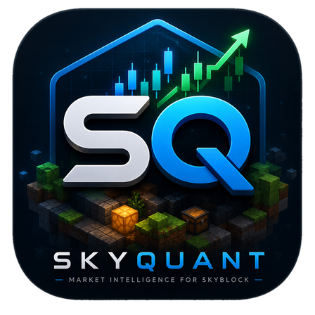
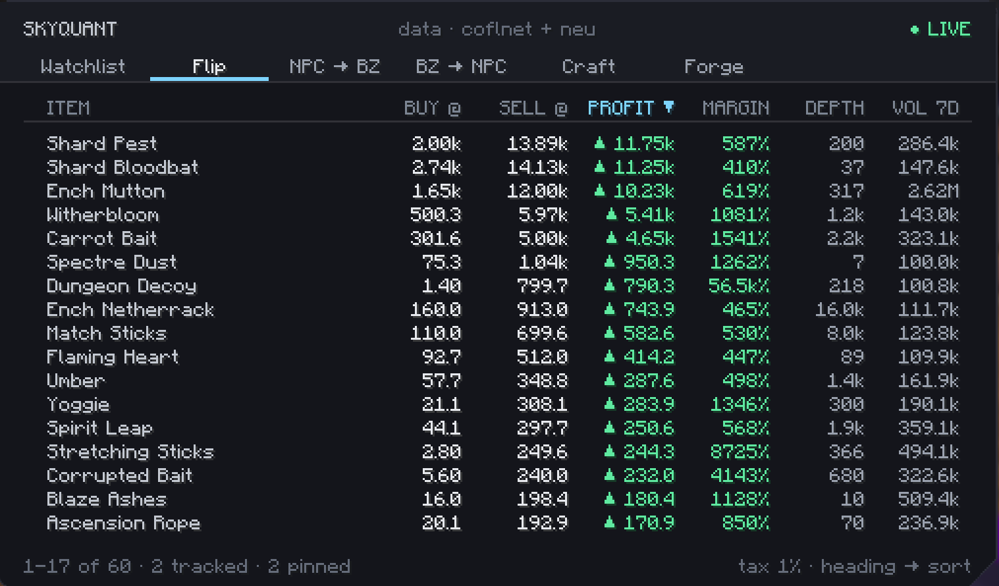
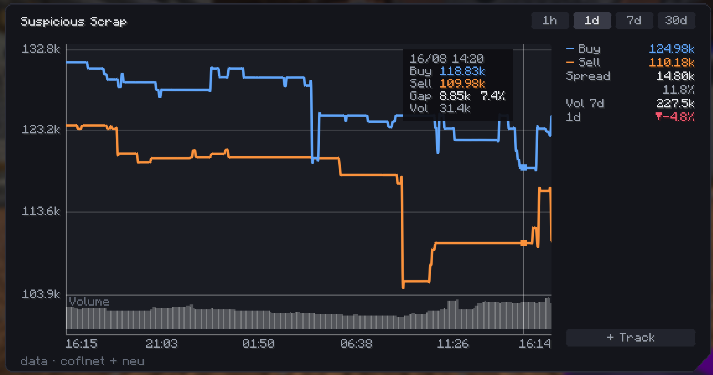
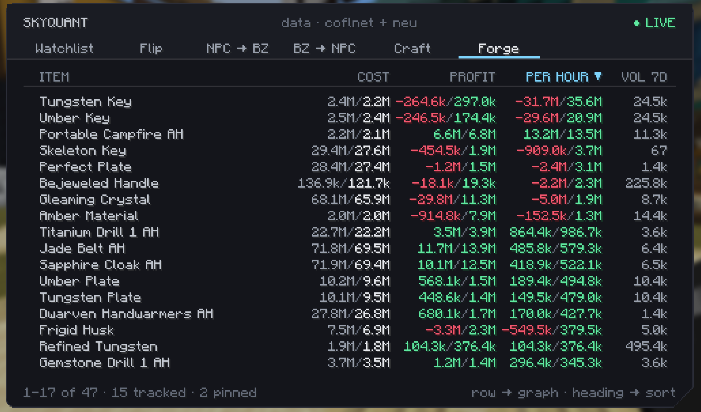
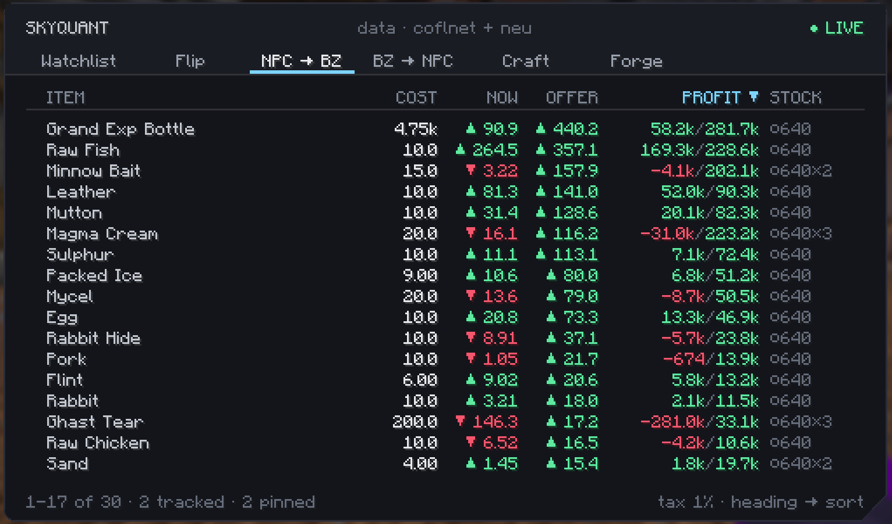
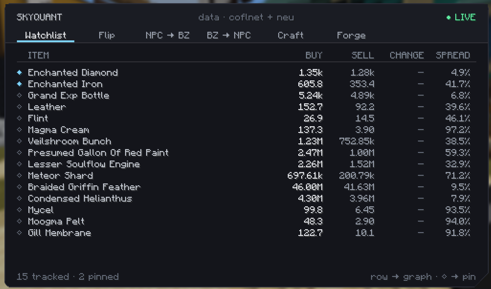
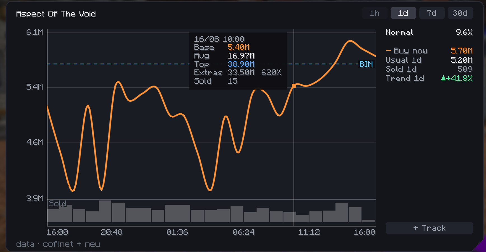
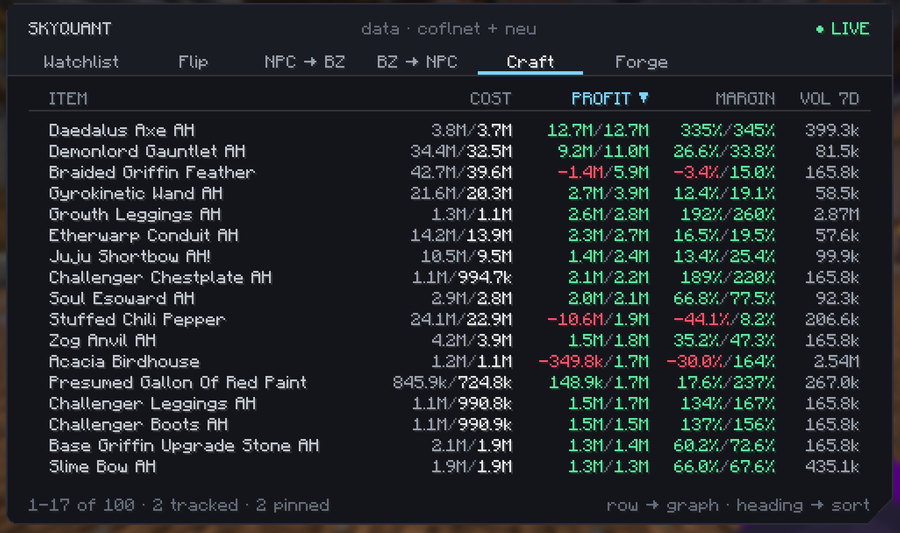
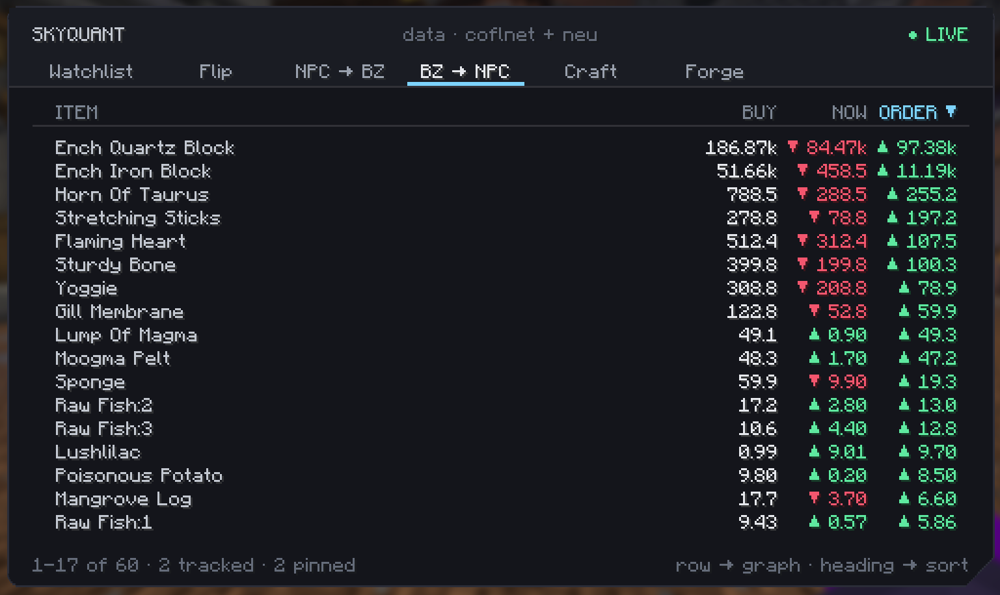

<div align="center">



# SkyQuant

### A market terminal for Hypixel SkyBlock

**Know what something is worth before you buy, craft or forge it.**

[](https://modrinth.com/mod/skyquant)
[](https://modrinth.com/mod/skyquant)
[](https://fabricmc.net)
[](LICENSE)

<kbd>B</kbd> opens the terminal · <kbd>G</kbd> charts the item you're pointing at · `/sq` if you prefer typing

</div>

<br>

<div align="center">

</div>

<br>

---

## What it's for

SkyBlock's economy is worth reading, and the game gives you almost nothing to read it with. The
bazaar shows two numbers and no history. The auction house shows what's listed, not what things
actually sell for. Working out whether a craft is worth it means a spreadsheet, three browser tabs,
and doing the tax by hand.

SkyQuant puts that in the game, as one screen you open with a key.

<br>

<table>
<tr>
<td width="50%" valign="top">

### 📊 Six views, one screen

**Watchlist** — your items, live
**Flip** — the bazaar by margin
**NPC → Bazaar** — buy cheap, sell dear
**Bazaar → NPC** — and the reverse
**Craft** — worth more made than bought?
**Forge** — best use of a slot, per hour

</td>
<td width="50%" valign="top">

### 📈 Charts that answer

**1h · 1d · 7d · 30d** on both markets
**Buy and sell curves** with the spread
**Lowest BIN** — what one costs *now*
**A verdict** — dear, cheap, or ordinary

</td>
</tr>
</table>

<br>

> ### Every figure is net of tax
>
> The mod reads your real Bazaar Flipper rate from the Community Shop menu, so the numbers match
> what you'll actually be charged. A terminal that shows gross profit is lying to you — on a 500k
> flip that's 6,250 coins it forgot to mention.

<br>

---

## Three things it does differently

<table>
<tr>
<td width="33%" valign="top">

#### 🎯 Prices from the book

Measured live: one item reported a sell price of **22.7** while the cheapest actual seller wanted
**7,002**.

One abandoned lowball order made it look like the best flip on the bazaar by a factor of ten.

Pricing from the top of the order book removes that whole class of phantom row — no spread ceiling
needed to paper over it.

</td>
<td width="33%" valign="top">

#### ⏱ The forge ranks per hour

Tungsten Key makes **259k in thirty seconds**. Gleaming Crystal makes **11.65M in six hours**.

Ranked on profit the crystal wins by 45×. Ranked on the rate, the key wins by 16×.

Only one of those is the advice worth acting on when a forge slot is what you're spending.

</td>
<td width="33%" valign="top">

#### 🔍 Thin markets get flagged

A cheapest listing well below the next one isn't a market price — it's one underpriced item.

Sampled across twelve items, nine sat within 1% of the second cheapest. Daedalus Axe sat at 28.6%.

That gap is shown, not hidden: the price is real, it just isn't a going rate.

</td>
</tr>
</table>

<br>

---

## See it

<div align="center">



*A bazaar chart: buy and sell curves, the spread between them, volume below.*

<br>



*The Forge, ranked on what a slot actually earns you per hour.*

<br>



*NPC → Bazaar, with each shop's remaining daily stock — the figure that decides whether a margin is worth the trip.*

</div>

<details>
<summary><b>More screenshots</b></summary>
<br>
<div align="center">



*Watchlist — your tracked items, with the spread on each.*



*Auction chart — the dashed line is what one costs to buy right now.*



*Craft — losses shown as readily as gains.*



*Bazaar → NPC, with both the instant price and what a buy order would fill at.*

</div>
</details>

<br>

---

## Install

| | |
|---|---|
| **Minecraft** | 26.1.2 |
| **Fabric Loader** | 0.17+ |
| **Fabric Language Kotlin** | required |
| [**Mod Menu**](https://modrinth.com/mod/modmenu) | optional — adds a Config button. Without it, `/skyquant` opens the same screen |

**[⬇ Download from Modrinth](https://modrinth.com/mod/skyquant)**

No Hypixel API key is needed, and the mod never asks you for one.

<br>

---

## What it does — and doesn't

**Does**
- Fetches public market data from public APIs and draws it
- Reads the tooltips of a menu *you already have open*, for two figures no API carries: your bazaar
  tax rate and an NPC shop's remaining stock

**Doesn't**
- ❌ Automate anything — no macros, no solvers, no auto-buying, no clicking or moving for you
- ❌ Touch packets — client-side only, every request is a plain HTTP `GET` to a public API
- ❌ **Send anything about you** — no account name, no UUID, no profile data leaves your client.
  Requests carry item ids and nothing else.

Every figure it shows is something anyone can look up in a browser at
[sky.coflnet.com](https://sky.coflnet.com/data) or Hypixel's own public API. It isn't an advantage
that depends on having the mod — it just saves you the alt-tab.

Hypixel doesn't approve or certify individual mods — its
[allowed-modifications page](https://support.hypixel.net/hc/en-us/articles/6472550754962-Hypixel-Allowed-Modifications)
lists categories rather than naming mods, and using any mod is at your own risk. The two things it
rules out in absolute terms are **automation** and **anything that alters how your client talks to
the server**. SkyQuant does neither.

<br>

---

<br>

# Technical

<br>

## Stack

| | |
|---|---|
| **Language** | Kotlin |
| **Loader** | Fabric |
| **Multi-version** | [Stonecutter](https://stonecutter.kikugie.dev) |
| **Config UI** | MoulConfig, shaded and relocated |
| **Mixins** | **none** — Fabric API events plus a four-line read-only access widener |
| **Tests** | 310, no game required |

Roughly 11,000 lines of Kotlin. `./gradlew test` runs the lot in a few seconds: everything that
doesn't touch a Minecraft class is testable, which is a reason to keep the arithmetic away from the
drawing in the first place.

<br>

## Layout

```
src/main/kotlin/dev/syqs/skyquant/
├── feature/bazaar/
│   ├── data/          fetching, caching, and the maths that decides what a row says
│   └── gui/           the terminal, the charts, the HUD overlay
├── config/            MoulConfig wiring, migrations, legacy file rename
├── hud/               draggable overlay registry and editor
└── util/              HTTP, JSON on disk, GitHub archive streaming, rate limiting
```

Full map in **[PROJECT_MAP.md](PROJECT_MAP.md)**.

<br>

## Data sources

| Source | What it gives | Cached |
|---|---|---|
| [Hypixel API](https://api.hypixel.net) | live bazaar, item catalogue | 60s / 24h on disk |
| [SkyCofl](https://sky.coflnet.com/data) | price history, auction listings, lowest BIN | per chart view |
| [NEU repository](https://github.com/NotEnoughUpdates/NotEnoughUpdates-REPO) | recipes, NPC shop prices | disk + ETag |

**Nothing is frozen into the jar.** Every source is fetched at runtime, so a Hypixel price patch
doesn't need a mod release to reach you. Where a source is large or slow-moving it's cached on disk
and asked "has this changed?" first — which costs a few hundred bytes rather than megabytes.

*Prices provided by SkyCofl.* Attribution to SkyCofl and the NEU repository is a **condition of
their terms**, not a courtesy, and is shown in-game as well as here. The credit lines come from
`DataCredits` — don't remove them.

What each source requires, and how each requirement is met, is in
**[docs/API_RESOURCES.md](docs/API_RESOURCES.md)**.

<br>

## Rate limiting

Coflnet publishes **30 requests per 10 seconds and 100 per minute per IP**, both windows applying
at once, and an IP that accumulates 500 rate-limit violations is **blocked automatically**. The
cost of getting this wrong isn't a failed request — it's a player losing access.

`CoflnetRateLimit` therefore counts requests **over time**, shared between every caller. A cap on
concurrent requests looks like pacing but isn't: four in flight completing in 100ms each is forty
requests in ten seconds, which is over the line.

A `429` is kept distinct from an ordinary failure, because it says nothing about the item that was
asked for. Treating it as "nothing listed" would cache that answer for a perfectly tradeable item,
for as long as the failure backoff lasts.

<br>

## Build

```bash
./gradlew buildAndCollect    # jar lands in build/libs/<version>/
./gradlew test               # 310 tests
./gradlew runClient          # test client
```

`runClient` needs a real Microsoft account to reach Hypixel, which
[DevAuth Neo](https://modrinth.com/mod/dev-auth-neo) in `run/mods` handles — it opens a login
browser on first launch and remembers you afterwards. Java 25 is required from Minecraft 26.1
onward; the Gradle toolchain will fetch it if you don't have it.

Fabric API is pulled per-module for the eight modules the mod actually uses, plus the full package
as `modRuntimeOnly` — development-only mods in `run/mods` routinely declare a hard dependency on
the `fabric-api` umbrella and refuse to load without it.

> **Pin Fabric API to the exact patch** (`+26.1.2`, never a generic `+26.1`). Mojang changes
> internal signatures between patches of the same drop, and a generic build breaks Fabric API's
> mixins at runtime. This has already cost one debugging round.

<br>

## Licence

**GPL-3.0-or-later.** Bundles [MoulConfig](https://github.com/NotEnoughUpdates/MoulConfig)
(LGPL-3.0), which includes LibNinePatch (MPL-2.0). Both licences travel inside the jar as
`LICENSE-SkyQuant.txt` and `LICENSE-MoulConfig.txt` — named so each says whose it is, because a
bare `LICENSE` at the root of a jar reads as the *mod's* licence.

<br>

---

<div align="center">

**[Modrinth](https://modrinth.com/mod/skyquant)** · **[Report a bug](https://github.com/Syqs19/SkyQuant/issues)** · **[API notes](docs/API_RESOURCES.md)** · **[Project map](PROJECT_MAP.md)**

<sub>NOT AN OFFICIAL MINECRAFT SERVICE. NOT APPROVED BY OR ASSOCIATED WITH MOJANG OR MICROSOFT.<br>
Not affiliated with or endorsed by Hypixel.</sub>

</div>
